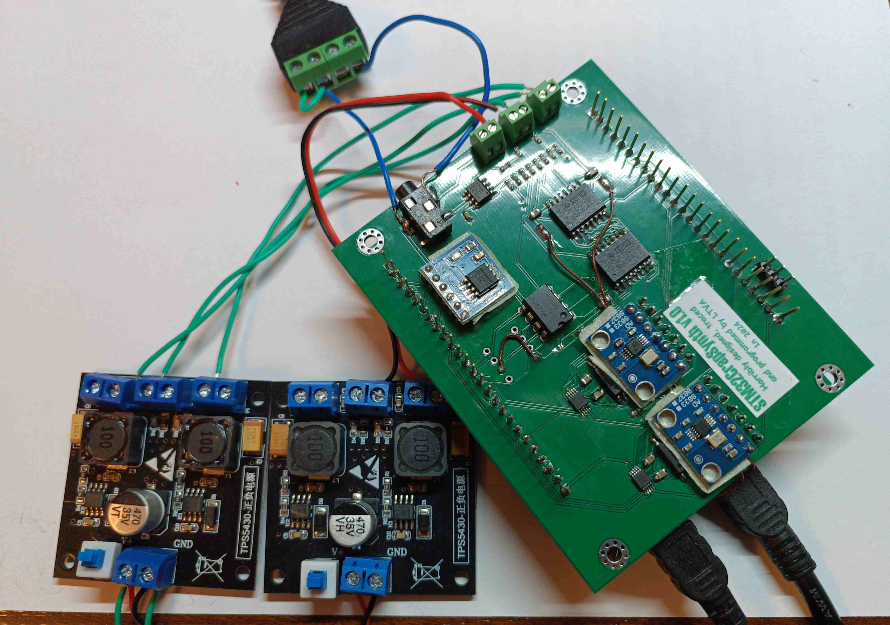
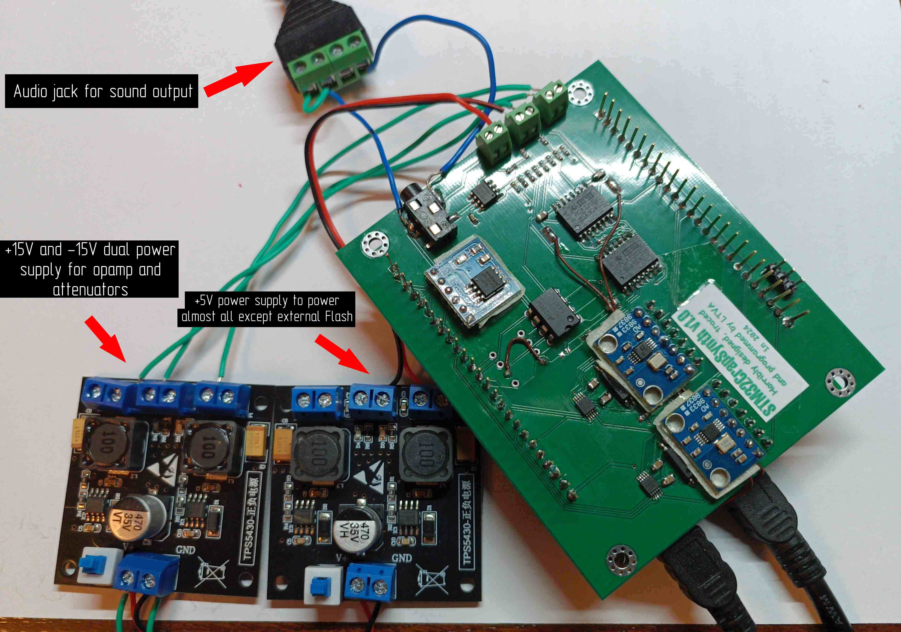
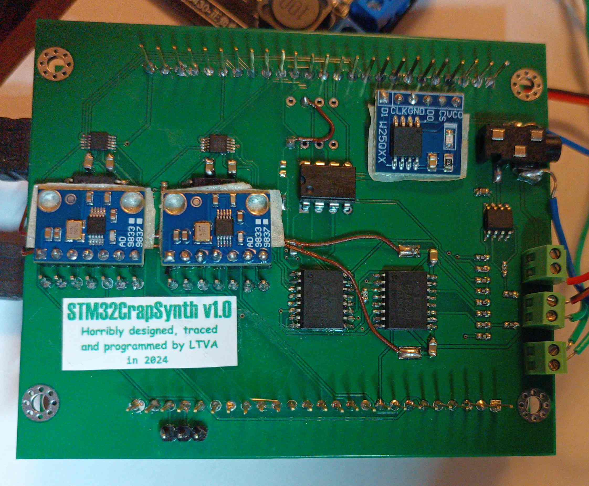
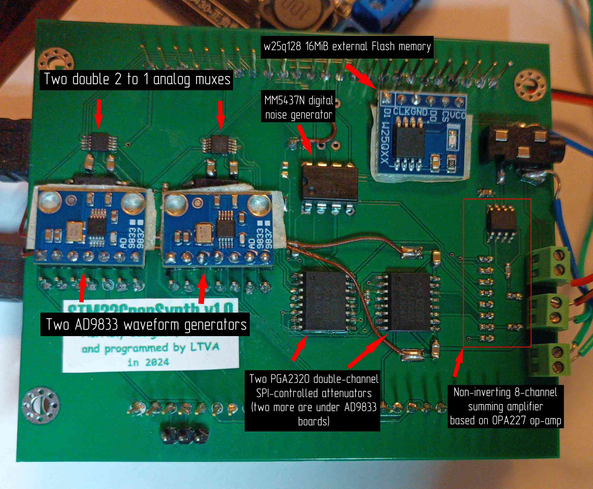
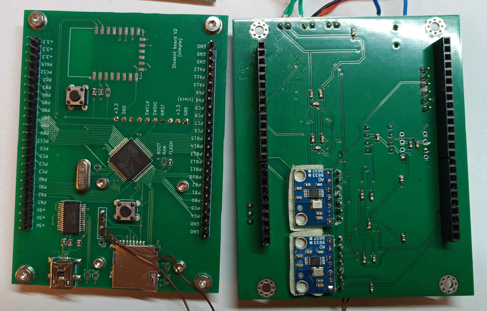
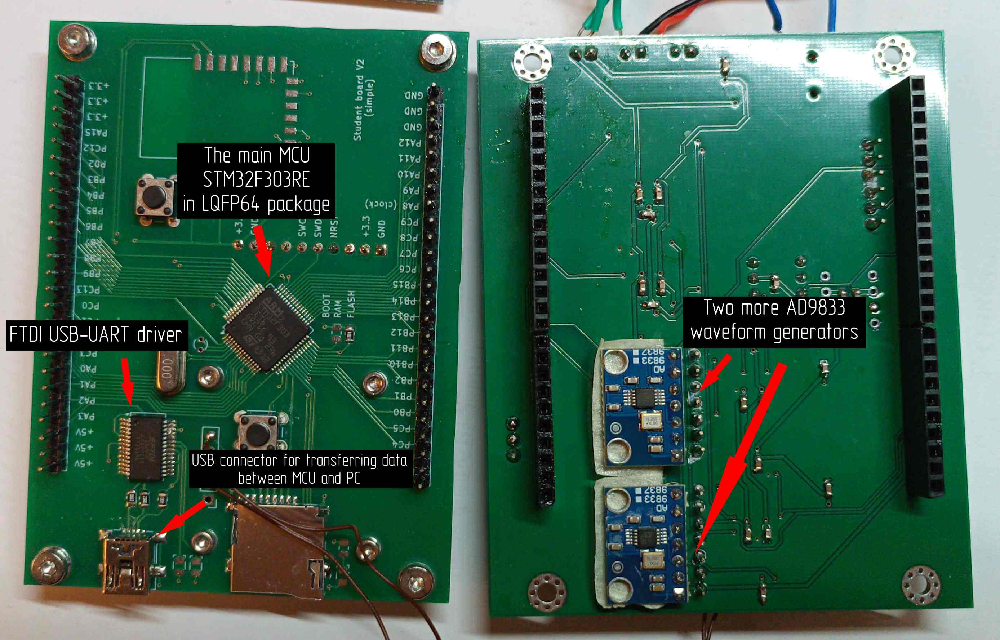
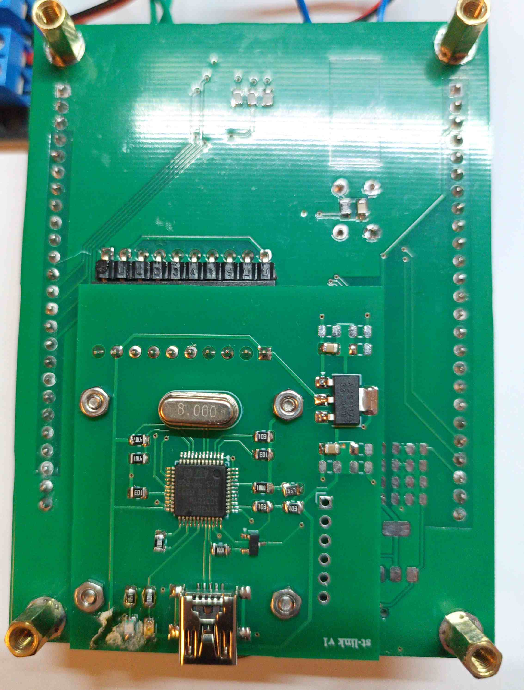

# STM32CrapSynth

A software/hardware synth based on STM32F303RE, 4xAD9833 wave generators, one MM5437 noise generator and LTC1063 lowpass filter. Currently I seem to have burned the filter so instead there's 3rd PCM channel using the timer that was planned for filter clocking.

# Music demo

[Here's the demo](https://www.youtube.com/watch?v=L5HF_qdjZyU). I recorded each channel separately for channel oscilloscopes and then recorded them all for master sound which you can hear in the video.

# Folders

`board` - KiCAD project of the board that mounts on top of custom teacher's board like Arduino shield.
`pc_program` - small CLI program using serial library to send data to the MCU. There also lies `.fur` tracker module of the soundtrack (but remember that emulation is finished and it sounds off at times compared to real hardware)
`STM32CrapSynthFirmware` - MCU firmware written only with CMSIS register defs and simple functions. Zero HAL, LL, SPL libraries usage.

# Other programs

[STM32CrapSynth in Furnace](https://github.com/LTVA1/furnace/tree/stm32crapsynth) - A fork of Furnace chiptune tracker with added emulation of STM32CrapSynth. Also has an ability to export data (samples and stream of commands/wavetable data) into the file which is then used by `pc_program`.

# Overview and explanation

The device is capable of synthesizing 8 audio channels. Their signals are added together and the resulting sum is available on standard 3.5 mm audio jack.

There also are six phase reset timers. Two of them are MCU's internal timers and four other are four MCU's internal USARTs/UARTs which were made to generate a periodic interrupt (just like the usual timers). Each timer has 8-bit bitmask dictating which channels it affects. Each time timer fires the correspodning channel's signal phase is reset.

The device consists of three PCBs. I designed only the topmost PCB with `STM32CrapSynth` logo. Lower two PCBs were designed by my teacher.

Here is the overall image of the whole device.

## Top PCB

Muxes are used to connect either MCU timer's PWM signal or AD9833 signal to the attenuator's input. Four channels are formed, each having the ability to play sound from its own PWM timer or from its own AD9833 waveform generator.

Attenuators allow to control the channel's volume with 0.5dB step.

Noise generator can either be clocked from its own internal oscillator or from external signal (the latter is generated by dedicated MCU timer in PWM generation mode). With external clock and another control signal it's also possible to load LFSR directly from MCU, which allows to reset the noise generation at any time. That's how it is possible to "phase reset" noise channel.

The rightmost attenuator controls signals that come from brown wires. These are soldered to the outputs on MCU board that act as MCU's internal DACs outputs.

Eighth channel emerges from PWM signal that comes directly from MCU pin. Since op-amp isn't designed to handle such high frequencies, the form of the signal from this channel is distorted as you can see in demo video (triangle wave is "smoothed" on one side).

Wires were soldered to an external wires-to-audio-jack adapter because, when designing a PCB, I used wrong audio jack footprint.

External Flash memory holds a dump of commands. These commands control frequency, volume and other settings of each audio channel. They also specify the rate of their execution. Each time the timer fires (240 times a second in demo video) command execution happens until a special command is encountered. The special command stops any further execution until the timer fires next time.

## Middle PCB

On the other side on top PCB there are capacitors for power noise elimination and two more AD9833 boards.

On middle PCB you can see the main MCU that performs all the work and USB-UART bridge. The data transfer rate is 2MBaud. Also the places where DAC signal wires are soldered are visible.

## Bottom PCB

Nothing special here, just a small PCB with custom STLink debugger design. A connector between bottom and middle PCB is visible on top. The USB connector provides power to STLink.

Also this board has 3.3V power regulator that supplies main MCU and external Flash memory.
